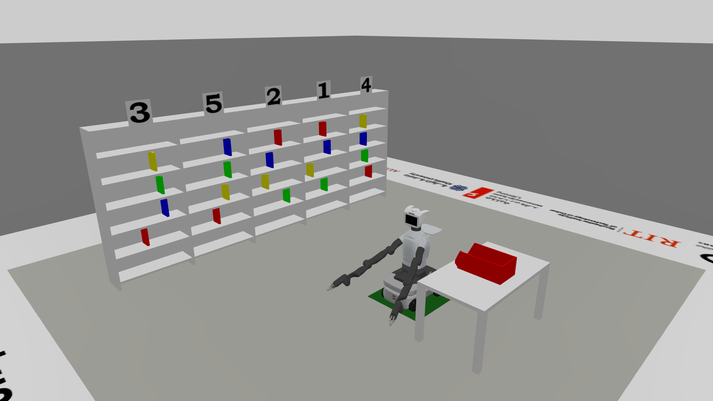

# Emirates Robotics Competition 2026

Library Assistant Robot challenge: Autonomous book retrieval using a TIAGo Pro mobile manipulator.

 

## Prerequisites

- x86_64 (amd64) architecture. ARM-based hosts (e.g. Apple Silicon) are not supported
- Linux host (Ubuntu 22.04/24.04 recommended) with X11
- Docker Engine + Docker Compose v2
- Git
- NVIDIA GPU + nvidia-container-toolkit for GPU-accelerated rendering        # Rendering is slow but possible without NVIDIA GPU
- ~15GB free disk space

**Note:** The default `ROS_DOMAIN_ID` is `23`. If you are running multiple ROS 2 environments on the same network, ensure there are no domain ID conflicts.

## Quick start

All dependencies are vendored in this repository — there is no separate dependency-fetching step, and no network access is needed after cloning.

```bash
# — Host terminal —
./docker/up.sh --build                        # Build image & start container
./docker/attach.sh                            # Open shell inside container

# — Inside container (after attach) —
colcon build --symlink-install                # Build workspace packages (first run takes several minutes)
source install/setup.bash                     # Source the workspace
ros2 launch erc_bringup mujoco_simulation.launch.py   # Launch MuJoCo + robot
```

The simulator runs headless by default, so it needs no display. Add
`headless:=false` to the launch command to get the MuJoCo viewer window.

To open additional terminals into the running container:
```bash
# — Host terminal —                           # Navigate to the repository root (where "docker/", "src/", and "docs/" are located)
./docker/attach.sh                            # Do NOT run ./docker/up.sh again as this will kill your running container
```

The video below is a visual guide for the above steps.

[docs/assets/quickstart_mujoco.mp4](docs/assets/quickstart_mujoco.mp4)

## Robot platform

TIAGo Pro by PAL Robotics — omnidirectional mobile manipulator.

**Hardware in simulation:**
- Omnidirectional mecanum base (4 mecanum wheels, full holonomic motion)
- Two 7-DOF arms (left and right) with PAL Pro grippers
- Pan-tilt head (2 DOF)
- Prismatic torso lift
- Intel RealSense D435 RGB-D camera (head-mounted)
- Two 270° LiDARs (front and rear, base-mounted)
- IMU (base)

## ROS 2 topics and controllers

### Mobile base

The base is holonomic and is driven as a whole body by `mujoco_ros2_control_plugins/BaseVelocityPlugin`, not through the wheel joints. Publish a standard `Twist` message to move the robot in any direction.

**The base is driven kinematically.** The plugin writes the base velocity straight into the simulation each step, so contact cannot slow the robot down: it will carry an arm through a shelf without resisting. Obstacle avoidance has to come from whatever is planning the motion, not from the physics. The arm joints are not like this — they are force-controlled and do respond to contact.

| Topic | Type | Direction | Description |
|---|---|---|---|
| `/cmd_vel` | `geometry_msgs/Twist` | Subscriber | Base velocity (linear.x, linear.y, angular.z) |
| `/odom` | `nav_msgs/Odometry` | Publisher | Wheel odometry |

**Examples:**
```bash
# Drive forward
ros2 topic pub /cmd_vel geometry_msgs/msg/Twist "{linear: {x: 0.3, y: 0.0}, angular: {z: 0.0}}" --rate 10

# Strafe left
ros2 topic pub /cmd_vel geometry_msgs/msg/Twist "{linear: {x: 0.0, y: 0.3}, angular: {z: 0.0}}" --rate 10

# Rotate in place
ros2 topic pub /cmd_vel geometry_msgs/msg/Twist "{linear: {x: 0.0, y: 0.0}, angular: {z: 0.5}}" --rate 10

# Diagonal movement (forward + left)
ros2 topic pub /cmd_vel geometry_msgs/msg/Twist "{linear: {x: 0.3, y: 0.3}, angular: {z: 0.0}}" --rate 10
```

### Joint controllers

All joint controllers use `joint_trajectory_controller/JointTrajectoryController` via `ros2_control`. Send trajectories using the action interface or the topic shortcut.

| Controller | Topic | Joints |
|---|---|---|
| `arm_left_controller` | `/arm_left_controller/joint_trajectory` | `arm_left_1_joint` .. `arm_left_7_joint` |
| `arm_right_controller` | `/arm_right_controller/joint_trajectory` | `arm_right_1_joint` .. `arm_right_7_joint` |
| `gripper_left_controller_raw` | `/gripper_left_controller/joint_trajectory` | `gripper_left_finger_joint` |
| `gripper_right_controller_raw` | `/gripper_right_controller/joint_trajectory` | `gripper_right_finger_joint` |
| `head_controller` | `/head_controller/joint_trajectory` | `head_1_joint`, `head_2_joint` |
| `torso_controller` | `/torso_controller/joint_trajectory` | `torso_lift_joint` |
| `imu_sensor_broadcaster` | `/base_imu` | Base IMU (read-only) |
| `joint_state_broadcaster` | `/joint_states` | All joints (read-only) |

**Note on the grippers.** Command the un-suffixed `/gripper_{left,right}_controller/joint_trajectory`, not the `_raw` topic. A guard node rejects any point outside the finger joint's usable range of `0.000` (closed) to `0.069` (open); commanding `_raw` directly bypasses it, and the gripper jams permanently if driven past its limit.

**Examples:**
```bash
# — Left arm: move joint 1 to 0.5 rad —
ros2 topic pub --once /arm_left_controller/joint_trajectory trajectory_msgs/msg/JointTrajectory \
  "{joint_names: [arm_left_1_joint, arm_left_2_joint, arm_left_3_joint, arm_left_4_joint, \
  arm_left_5_joint, arm_left_6_joint, arm_left_7_joint], \
  points: [{positions: [0.5, 0.0, 0.0, 0.0, 0.0, 0.0, 0.0], time_from_start: {sec: 2}}]}"

# — Right arm: move joint 1 to -0.5 rad —
ros2 topic pub --once /arm_right_controller/joint_trajectory trajectory_msgs/msg/JointTrajectory \
  "{joint_names: [arm_right_1_joint, arm_right_2_joint, arm_right_3_joint, arm_right_4_joint, \
  arm_right_5_joint, arm_right_6_joint, arm_right_7_joint], \
  points: [{positions: [-0.5, 0.0, 0.0, 0.0, 0.0, 0.0, 0.0], time_from_start: {sec: 2}}]}"

# — Left gripper: close (0.0 = closed, 0.069 = fully open) —
ros2 topic pub --once /gripper_left_controller/joint_trajectory trajectory_msgs/msg/JointTrajectory \
  "{joint_names: [gripper_left_finger_joint], \
  points: [{positions: [0.0], time_from_start: {sec: 1}}]}"

# — Left gripper: open —
ros2 topic pub --once /gripper_left_controller/joint_trajectory trajectory_msgs/msg/JointTrajectory \
  "{joint_names: [gripper_left_finger_joint], \
  points: [{positions: [0.04], time_from_start: {sec: 1}}]}"

# — Right gripper: close —
ros2 topic pub --once /gripper_right_controller/joint_trajectory trajectory_msgs/msg/JointTrajectory \
  "{joint_names: [gripper_right_finger_joint], \
  points: [{positions: [0.0], time_from_start: {sec: 1}}]}"

# — Right gripper: open —
ros2 topic pub --once /gripper_right_controller/joint_trajectory trajectory_msgs/msg/JointTrajectory \
  "{joint_names: [gripper_right_finger_joint], \
  points: [{positions: [0.04], time_from_start: {sec: 1}}]}"

# — Head: pan left 0.5 rad, tilt down 0.3 rad —
ros2 topic pub --once /head_controller/joint_trajectory trajectory_msgs/msg/JointTrajectory \
  "{joint_names: [head_1_joint, head_2_joint], \
  points: [{positions: [0.5, -0.3], time_from_start: {sec: 1}}]}"

# — Torso: raise to 0.3 m —
ros2 topic pub --once /torso_controller/joint_trajectory trajectory_msgs/msg/JointTrajectory \
  "{joint_names: [torso_lift_joint], \
  points: [{positions: [0.3], time_from_start: {sec: 2}}]}"
```

### Sensors

| Topic | Type | Description |
|---|---|---|
| `/scan_front_raw` | `sensor_msgs/msg/LaserScan` | Front LiDAR |
| `/scan_rear_raw` | `sensor_msgs/msg/LaserScan` | Rear LiDAR |
| `/head_front_camera/head_front_camera/color/image_raw` | `sensor_msgs/msg/Image` | Head RGB camera |
| `/head_front_camera/head_front_camera/color/camera_info` | `sensor_msgs/msg/CameraInfo` | Head RGB camera info |
| `/head_front_camera/head_front_camera/depth/image_rect_raw` | `sensor_msgs/msg/Image` | Head depth camera (float32) |
| `/head_front_camera/head_front_camera/depth/camera_info` | `sensor_msgs/msg/CameraInfo` | Head depth camera info |
| `/head_front_camera/head_front_camera/depth/color/points` | `sensor_msgs/msg/PointCloud2` | |
| `/base_imu` | `sensor_msgs/msg/Imu` | Base IMU |
| `/spectator/color` | `sensor_msgs/msg/Image` | Fixed arena view |
| `/spectator/depth` | `sensor_msgs/msg/Image` | |
| `/spectator/camera_info` | `sensor_msgs/msg/CameraInfo` | |
| `/model_states` | `mujoco_ros2_control_msgs/msg/FreeJointStateArray` | Ground-truth pose and twist of every free body, in the world frame |

There are no contact-sensor topics. Grasp force is readable from the `effort` field of `/joint_states`, and object placement from `/model_states`.

### Sensor specifications

| Sensor | Parameter | Value |
|---|---|---|
| **Head RGB camera** | Resolution | 640 × 360 px |
| | Horizontal FOV | 1.518 rad (87°) |
| | Vertical FOV | 0.981 rad (56.19°) |
| | Update rate | 30 Hz |
| **Head depth camera** | Resolution | 640 × 360 px |
| | Depth range | 0.2 – 8.0 m |
| | Update rate | 30 Hz |
| **Front / Rear LiDAR** | Model | SICK TIM551 |
| | FOV | ~270° |
| | Range | 0.05 – 25.0 m |
| | Samples | 818 (0.33°/step) |
| | Update rate | 10 Hz |
| **Base IMU** | Update rate | 250 Hz |


## Software stack

| Component | Version |
|---|---|
| ROS 2 | Humble |
| Physics engine | MuJoCo |
| DDS | CycloneDDS |
| Robot description | PAL Robotics (vendored, see above) |
| Controller framework | ros2_control + mujoco_ros2_control |

## Vendored dependencies

| Package | Upstream | Branch |
|---|---|---|
| `launch_pal` | https://github.com/pal-robotics/launch_pal | `master` |
| `pal_urdf_utils` | https://github.com/pal-robotics/pal_urdf_utils | `humble-devel` |
| `pal_gripper` | https://github.com/pal-robotics/pal_gripper | `humble-devel` |
| `pal_pro_gripper` | https://github.com/pal-robotics/pal_pro_gripper | `humble-devel` |
| `tiago_pro_robot` | https://github.com/pal-robotics/tiago_pro_robot | `humble-devel` |
| `pal_sea_arm` | https://github.com/pal-robotics/pal_sea_arm | `humble-devel` |
| `tiago_pro_head_robot` | https://github.com/pal-robotics/tiago_pro_head_robot | `humble-devel` |
| `omni_base_robot` | https://github.com/pal-robotics/omni_base_robot | `humble-devel` |
| `mujoco_ros2_control` | https://github.com/pal-robotics-forks/mujoco_ros2_control | `main` |

## URDF generation

The robot URDF is generated from PAL's xacro sources and saved to `src/erc_description/urdf/tiago_pro.urdf` which is accessible on the host for inspection. Because the workspace is built with `--symlink-install`, the URDF is picked up immediately when created with no rebuild required. The simulator-specific retarget — MuJoCo actuators, gripper loop closures, camera and gravity compensation — is applied on top of that file at launch, so the URDF stays the single description that both the simulator and any real-robot tooling start from.

## Arena

The arena is generated as MJCF at launch. `ERC_SEED` (or `seed:=`) fixes the book colours and the shelf number order; the same seed always produces the same arena. Pass `scene:=/path/to/scene.xml` to load a different MJCF scene instead.

## Reporting issues

If you notice a bug, an error in the documentation, or anything in the code that needs changing, please submit an issue on the repository rather than reporting it elsewhere. This keeps all known issues visible and traceable for both participants and organisers.


1. In the "Title" field, type a title for your issue.
2. In the comment body field, type a description of your issue. To cross-reference a related discussion, paste the discussion's URL into the issue description.

Before opening a new issue, search existing issues to check whether it has already been reported. When describing your issue, include:

- Steps to reproduce the problem
- Expected vs. actual behaviour
- Relevant terminal output or logs
- Your host environment (OS, GPU, `ROS_DOMAIN_ID` if changed from default)

## Troubleshooting

**CycloneDDS serialization warnings** (`serdata.cpp` errors about null-terminated strings) — these are harmless noise from large message serialization. They don't affect functionality.

**Nothing on any topic for the first few seconds** — the robot description is converted to MJCF before the simulator starts, which takes a few seconds. Controllers are spawned on a 5-second timer.

**Controllers not activating** — check that `erc_bringup` was built: `colcon build --symlink-install --packages-select erc_bringup && source install/setup.bash`

**Base not strafing (lateral movement)** — ensure you're publishing to `/cmd_vel` with `linear.y` set. The base is holonomic and driven directly, so lateral motion does not depend on wheel friction.

**Build errors after mixing build flags** — always build with `--symlink-install`. Mixing symlink and non-symlink builds leaves stale artifacts; recover with `rm -rf build/ install/ log/` and rebuild.

**Rebuild after Dockerfile changes** — run `./docker/up.sh --build` to rebuild the image.

**DDS discovery storms on a busy network** — the container leaves `ROS_LOCALHOST_ONLY` unset so a second machine or a host-side RViz can see the topics. On a crowded LAN this can stall the simulation; export `ROS_LOCALHOST_ONLY=1` before launching to confine DDS to loopback.
